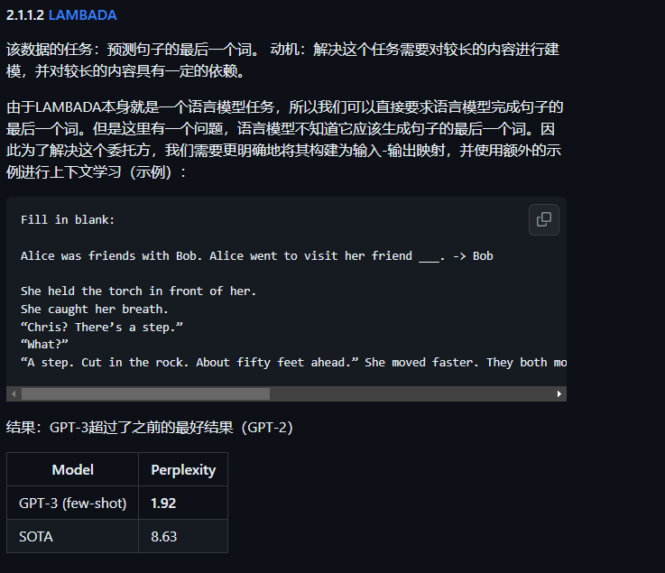
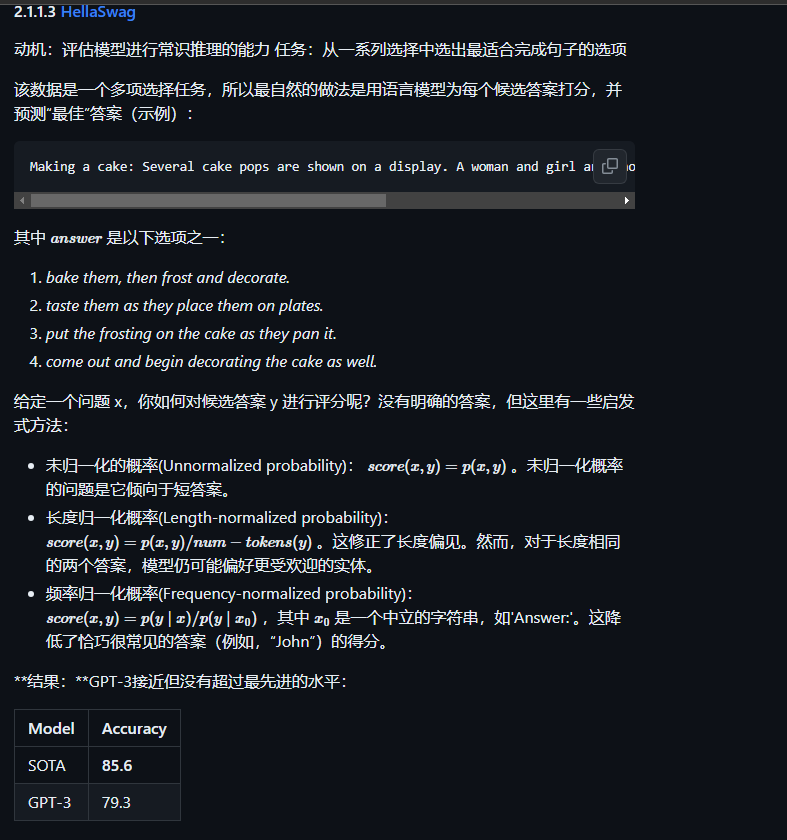
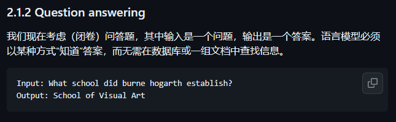
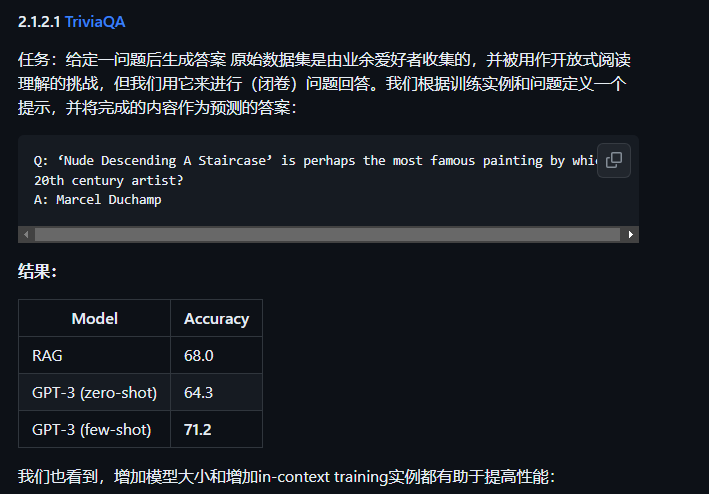
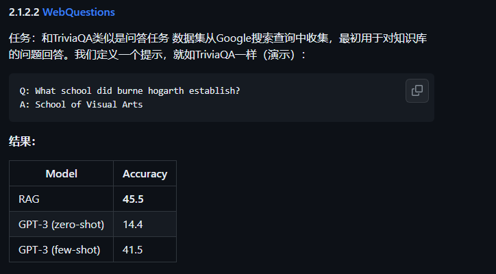
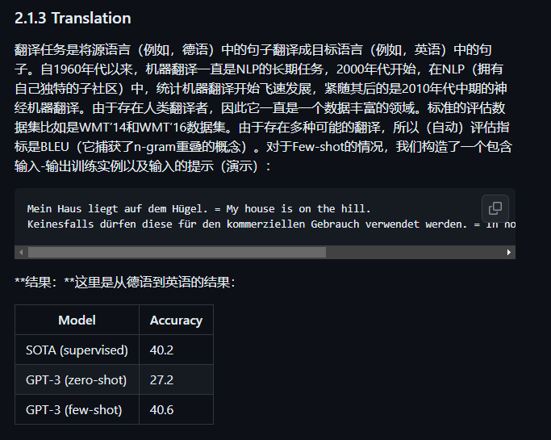

# 大模型的能力

## adaptation

### how to adaptate

- 训练, 标准有监督学习
- 提示学习
  - zero shot
  - few shot
  - one shot
  
### 语言建模 language modeling

通俗的说, 语言预测用一个公式可以表达(联合概率):

$$
p(x_{1:L}) = \prod_{i=1}^L p(x_i \mid x_{1:i-1}).
$$

那么自然要衡量语言模型的能力程度,朴素困惑度一般定义为:

$$
P(X) = P(x_1,x_2,...,x_N)^{(-1/N)}
$$

当N很大时, 我们不希望它影响对模型能力的评估,因此这里不使用算数平均, 而是使用几何平均.

以下是更精准的困惑度定义:
$$ \text{perplexity}p\left(x{1: L}\right)=\exp \left(\frac{1}{L} \sum_{i=1}^L \log \frac{1}{p\left(x_i \mid x_{1: i-1}\right)}\right) \text {. } $$

由来是交叉熵:

$$
H(p, q)=-\sum_x p(x) \log q(x)
$$

p(x)是真实的分布,而q(x)是我们理想中的分布, 我们简单的预测word理解为这个序列{the mouse ate the ___}选词, 假定要选的语言特别简单只有{a, b ,c, d}四个词(实际上词库超级大),那么
真实的即为这种形式P[1, 0, 0, 0], 如果模型啥也不懂(没有训练效果)那么Q[1/4, 1/4, 1/4, 1/4], 带入交叉熵公式可得:

$$
H(p, q)= - \log \frac{1}{4} 
$$
$$
\exp^{H(p, q)}=4
$$

可得模型非常困惑, 啥也不懂. 如果perplexity=3 那么训练就对模型有效果,模型的困惑度就下降了..

- perplexity=1 模型太吊了,不会错
- perplexity=0 完全是错的
- perplexity<= 词数量，模型还有点效果

模型可能犯错误:

- 召回错误:语言模型未能正确地为某个词符分配概率值
- 语言模型为某些错误的词序列过度分配了概率值。我们可以进行适度的惩罚
  - 将垃圾分布混入
$$
q(x_i \mid x_{1:i-1}) = (1-\epsilon) p(x_i \mid x_{1:i-1}) + \epsilon r(x_i \mid x_{1:i-1}).
$$
$$ \text{perplexity}q(x{1:L}) \le \frac{1}{1 - \epsilon} \text{perplexity}p(x{1:L}) \approxeq (1 + \epsilon) \text{perplexity}p(x{1:L}), $$

## GPT困惑度测试

等等
-  News article generation
-  Novel tasks

## 总结

- 使用perplexity评估大模型
- adaptation确实效果很好,gpt在经过简单的prompt learning后效果超过了现有的sota模型

192.168.3.118

