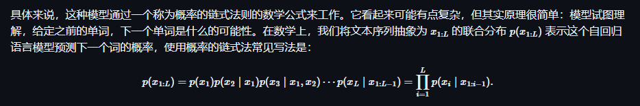

# LLM intro

## 语言模型

计算词语在句子中出现position的概率,换言之$x_{i:L}$的概率分布

### auto regressive model

链式概率法则, 根据已经有的词语来预测下一个词语

**温度参数T**:通过T来改变概率分布以达到控制语言模型多样性的结果

### 英语的熵

香农给出了信息熵的概念,并将其用到对英语的兴趣上.同时交叉熵是H(p)的上界,熵值越小,模型就精准,所以要构建更好的模型q

### n-gram

ngram由于天生缺陷(超大的词典),注定n值不能太大,太大导致效果太差,而且还是单向的

### 基于神经网络的语言模型

更好的顾及上下文,我不由得想起了skip gram和cbow,近年的rnns lstm transformer效果更好了.

## 语言模型越来越大

通过自监督预训练:
- 基于上下文,预测词语
- 对比学习
等方法来训练一个超大的基座模型,然后下游微调.

