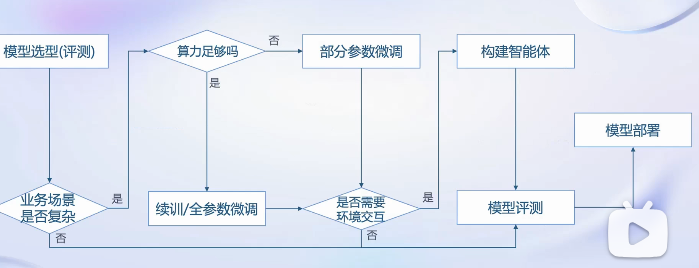
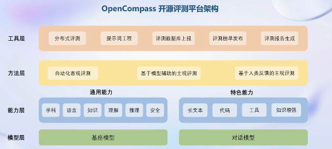
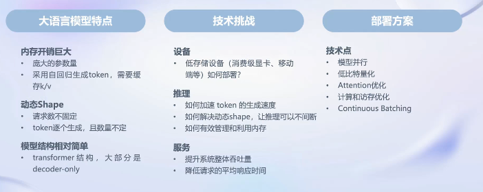
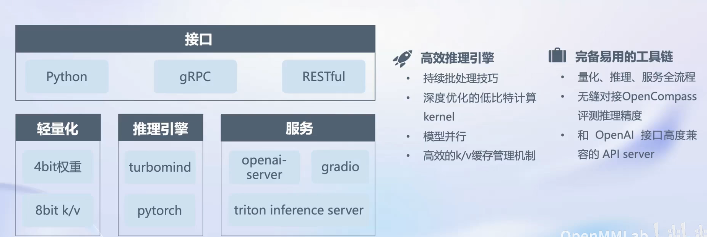
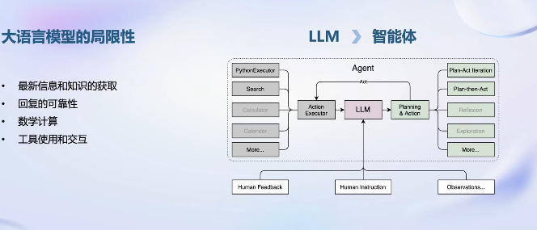

# 了解全链路工具
    数据 预训练 微调 部署 评测 应用 全链路

## Data
书生万卷：包含文字、多模态等任务，高质量数据。

## Pre-train 
internlm-train预训练工具：兼容主流 性能优化 开箱即用

## Tune
- 垂直领域做domain-pretrain，继续训练。
- 有监督微调

Xtuner：最低只需要8g就能微调7B！能够适配各种算法以及开源的模型以及数据集。

## Evaluation
Opencompass:评测体系

## Deploy
本人目前关注部署技术点：
- 量化
- attention优化

部署工具LMDeploy：各种都支持，好好好。

## 智能体

