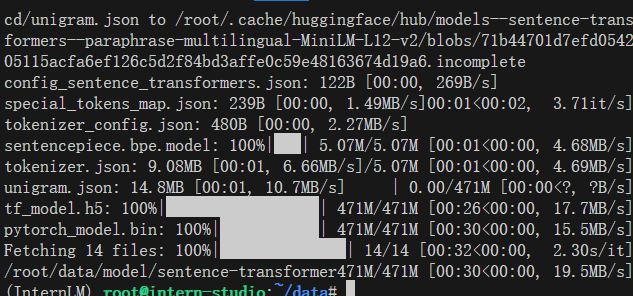
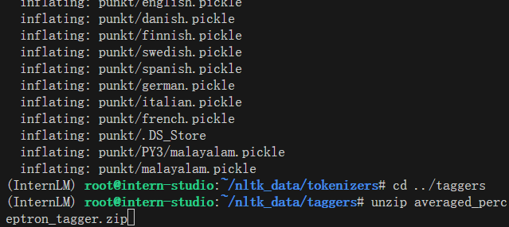
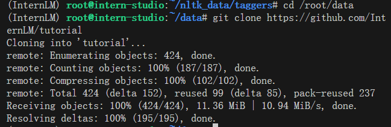
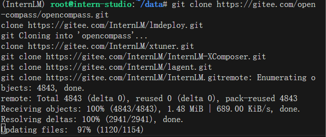
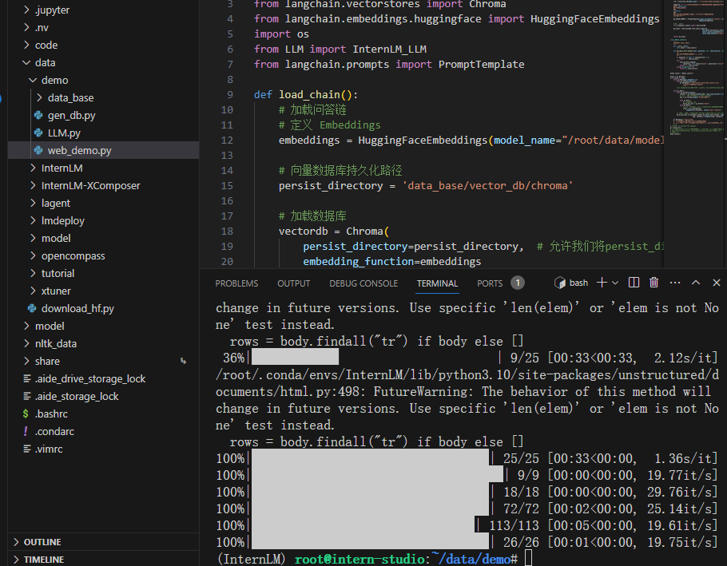
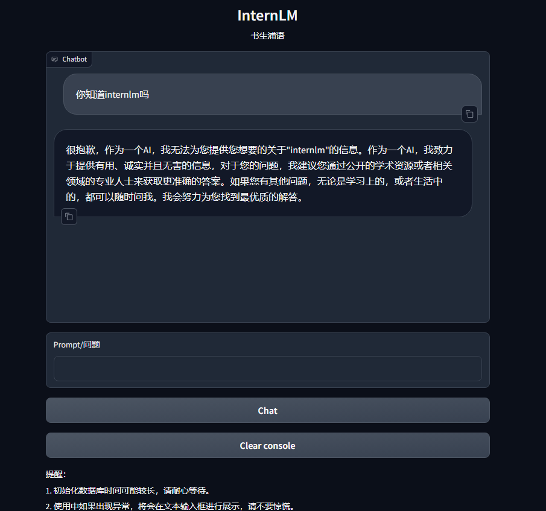
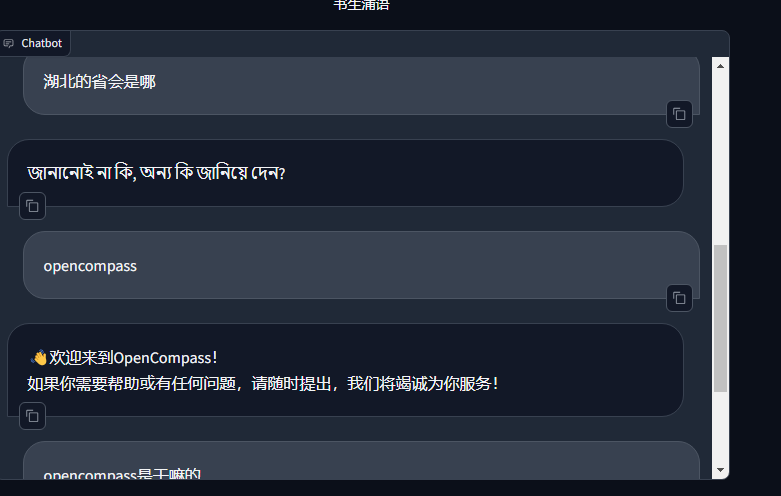
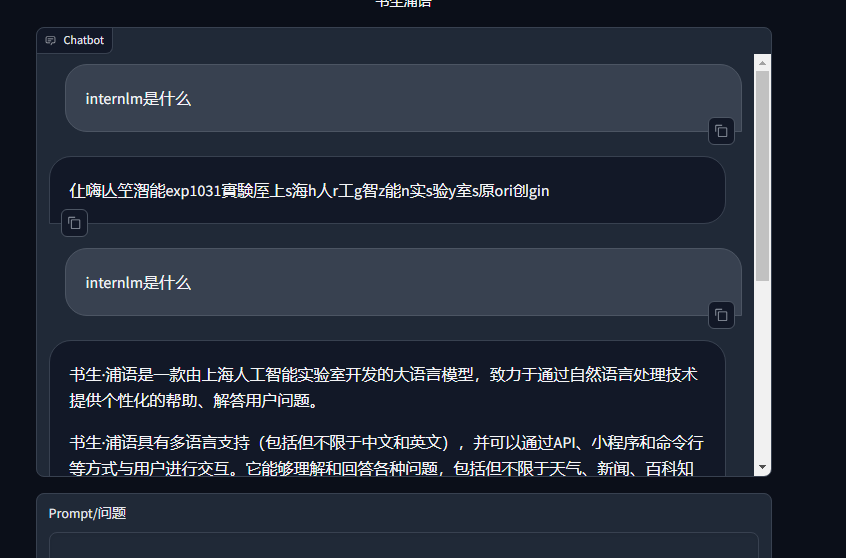

# langchain 作业

## 部署环境
    部署环境跟着教程来~没什么好写的

## 下载sentence embedding
报错

    huggingface-cli: not found

使用该博客解决https://blog.csdn.net/weixin_40959890/article/details/129819257



## NLTK
跟着教程.....


## 下载项目



## 数据库搭建


**知识库**

## 启动网页 

这里我提前在跑通web前使用ssh连了自己电脑，发现web没有html效果，然后ctrl c停了连接，发现跑通web后连不上ssh了，于是乎重启开发机...

发现直接在浏览器里127.0.0.7860就好了...
## 效果





## 问题
- 会出现奇奇怪怪的语言，还会乱码。起码有部分是正常的，感觉是文字切片的问题。

## 解决乱码尝试
感觉是分块方式问题，尝试：
```python
text_splitter = CharacterTextSplitter(
    chunk_size=500, chunk_overlap=150)
split_docs = text_splitter.split_documents(docs)
```

未解决。。。。


## 进阶作业

