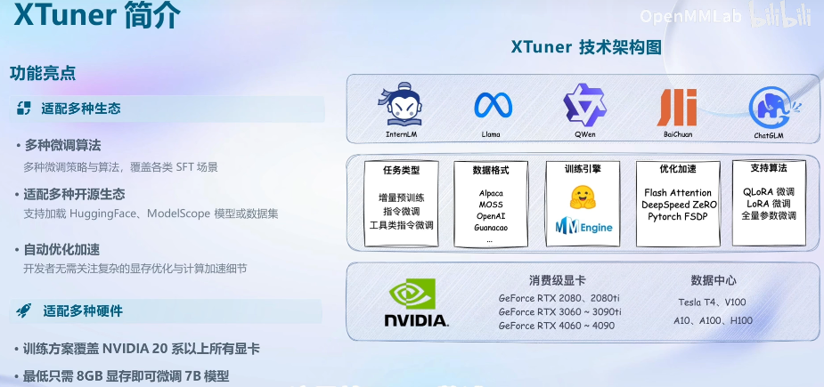

# XTuner 实战

## 1.funetune

### 1.1 增量预训练 
理解为domain pretrain

### 1.2 指令跟随微调


instructed gpt 有监督训练
构建模版

#### 1.2.1 LORA & QLORA


- 量化4bitwow微调

## 2. Xtuner
    数据格式处理 对话模版 packdataset 加速训练


### 数据格式处理
目标格式


```json
[{
    "conversation":[
        {
            "system": "xxx",
            "input": "xxx",
            "output": "xxx"
        }
    ]
},
{
    "conversation":[
        {
            "system": "xxx",
            "input": "xxx",
            "output": "xxx"
        }
    ]
}]
```

### 对话模版


### 加速训练
- deepspeed-zero
- falsh-attention

### 多数据拼接


## 快速上手 


## 实战 
[文档](https://github.com/InternLM/tutorial/blob/main/xtuner/README.md)